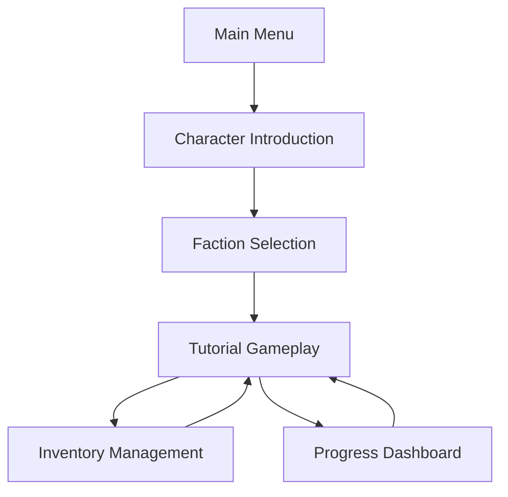

# WAGUS: Origins - Product Requirements Document

## 1. Product Overview
WAGUS: Origins is a single-player tutorial instance for a Web3 MMORPG set in a futuristic digital city with cyber-mysterious atmosphere. Built on React and Solana blockchain, it introduces players to faction-based gameplay and core mechanics before future multiplayer expansion.

The product solves the problem of complex Web3 gaming onboarding by providing an accessible single-player tutorial that teaches blockchain gaming concepts through engaging storytelling and faction-based progression.

## 2. Core Features

### 2.1 User Roles
| Role | Registration Method | Core Permissions |
|------|---------------------|------------------|
| Default Player | Direct game access | Can play tutorial, choose faction, earn tokens, access all gameplay mechanics |

### 2.2 Feature Module
Our WAGUS: Origins tutorial consists of the following main pages:
1. **Main Menu**: game logo, start tutorial button, faction overview.
2. **Character Introduction**: SUGA character interaction, lore exposition, corruption revelation.
3. **Faction Selection**: three faction choices (SUGA, WAGUS, BONK), faction descriptions, selection confirmation.
4. **Tutorial Gameplay**: core mechanics training (mining, scanning, hacking, combat, magic), token earning system.
5. **Inventory Management**: item display, metadata viewing, token balance tracking.
6. **Progress Dashboard**: tutorial completion status, faction progress, earned rewards summary.

### 2.3 Page Details
| Page Name | Module Name | Feature description |
|-----------|-------------|---------------------|
| Main Menu | Game Logo | Display WAGUS: Origins branding with cyber-themed visual design |
| Main Menu | Start Button | Initialize tutorial sequence and navigate to character introduction |
| Main Menu | Faction Preview | Show brief overview of three available factions with visual themes |
| Character Introduction | SUGA Interaction | Present dialogue system with SUGA character revealing crypto corruption |
| Character Introduction | Lore Exposition | Display futuristic digital city background and mystery elements |
| Character Introduction | Story Progression | Guide player through narrative introduction with interactive elements |
| Faction Selection | SUGA Faction | Red/black themed option representing corruption investigation |
| Faction Selection | WAGUS Faction | Black/white themed option representing balanced crypto approach |
| Faction Selection | BONK Faction | Colorful themed option representing laid-back gaming experience |
| Faction Selection | Selection Confirmation | Confirm faction choice and initialize faction-specific progression |
| Tutorial Gameplay | Mining Mechanics | Interactive mining mini-game with resource collection and token rewards |
| Tutorial Gameplay | Scanning System | Environmental scanning tool for discovering hidden secrets and items |
| Tutorial Gameplay | Hacking Interface | Puzzle-based hacking challenges with cyber-themed visual feedback |
| Tutorial Gameplay | Combat Training | Turn-based or real-time combat tutorial with faction-specific abilities |
| Tutorial Gameplay | Magic System | Spell casting mechanics with visual effects and mana management |
| Tutorial Gameplay | Token Earning | Faction-specific token rewards (SUGA/WAGUS/BONK) based on activities |
| Inventory Management | Item Display | Grid-based inventory showing collected items with visual representations |
| Inventory Management | Metadata Viewing | Detailed item information including stats, rarity, and blockchain data |
| Inventory Management | Token Balance | Real-time display of earned faction tokens with Solana integration |
| Progress Dashboard | Tutorial Progress | Visual progress bar showing completion status of tutorial modules |
| Progress Dashboard | Faction Standing | Display faction-specific achievements and progression metrics |
| Progress Dashboard | Rewards Summary | Comprehensive view of all earned tokens, items, and achievements |

## 3. Core Process
The main user flow begins with the player accessing the main menu and starting the tutorial. They first meet SUGA who introduces the game's lore about corruption in the crypto ecosystem. Players then choose between three factions: SUGA (red/black corruption investigation theme), WAGUS (black/white balanced approach), or BONK (laid-back fun experience).

After faction selection, players enter the tutorial gameplay where they learn five core mechanics: mining for resources, scanning environments for secrets, hacking systems through puzzles, engaging in combat, and casting magic spells. Each activity rewards players with their chosen faction's tokens. Throughout the tutorial, players can access their inventory to view collected items and check their progress dashboard to track completion and rewards.

## 4. User Interface Design
### 4.1 Design Style
- Primary colors: Deep cyber blue (#0A1628), electric cyan (#00D4FF)
- Secondary colors: Faction-specific (SUGA: red #FF0000/black #000000, WAGUS: black #000000/white #FFFFFF, BONK: vibrant multi-color palette)
- Button style: Rounded corners with neon glow effects and hover animations
- Font: Futuristic sans-serif (Orbitron or similar), sizes 14px-24px for body text, 32px+ for headers
- Layout style: Card-based design with translucent panels, top navigation with faction indicator
- Icon style: Minimalist cyber-themed icons with subtle animations and neon accents

### 4.2 Page Design Overview
| Page Name | Module Name | UI Elements |
|-----------|-------------|-------------|
| Main Menu | Game Logo | Large centered logo with animated cyber effects, gradient background #0A1628 to #1A2B4C |
| Main Menu | Start Button | Prominent cyan button (#00D4FF) with pulsing glow, 18px Orbitron font |
| Character Introduction | SUGA Interaction | Character portrait on left, dialogue box with typewriter effect, dark theme with red accents |
| Faction Selection | Faction Cards | Three equal-sized cards with faction colors, hover effects, and selection animations |
| Tutorial Gameplay | Activity Interface | Modular UI panels for each mechanic, progress indicators, token counter in top-right |
| Inventory Management | Item Grid | 6x4 grid layout with item slots, hover tooltips, search/filter functionality |
| Progress Dashboard | Progress Visualization | Circular progress rings, achievement badges, faction-themed color schemes |

### 4.3 Responsiveness
The product is desktop-first with mobile-adaptive design considerations. Touch interaction optimization is planned for future mobile expansion, with current focus on mouse and keyboard controls for the tutorial experience.